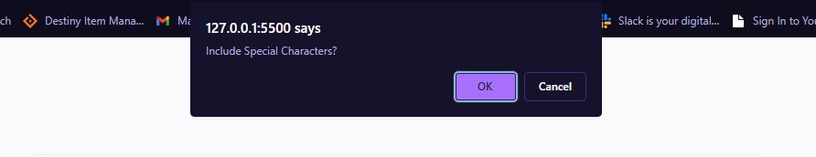

My entrty for # challenge 03

This is a simple password generator that calls multiple functions to give the
user options on how long the password should be and include special characters.

https://mrmcevans.github.io/Simple-Password-Generator/